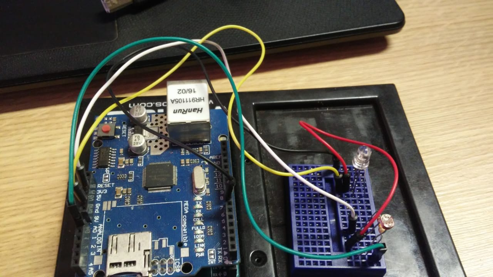

# Trabalho Final da disciplina de Tópicos Especiais III 

## Projeto Smart Lamp

### Introdução
O sistema como um todo gira em torno de uma lâmpada inteligente (e ai você pode imaginar várias situações onde está lâmpada possa estar, um quarto, uma sala, whatever). Está lâmpada representada como um LED deve ficar apagada durante o dia e caso seja noite esta lâmpada só deve ser acesa caso haja alguém dentro do ambiente. Para isso foram utilizadas tecnologias como o Arduino, NodeJS e MQTT.

#### Dispositivos embarcados
- **Hardware necessário**
    - Arduino UNO
    - Shield Ethernet
    - Sensor de Luminosidade
    - LED'S
    - Resistores
    - Jumpers
- **Circuito**

- **Funcionamento**

Basicamente, precisa definir variáveis com ip que o arduino vai usar, ip do servidor (máquina que vai estar rodando o serviço consumido pelo arduino), uma variável para guardar o pino que o LED está ligado, uma variável para ficar armazenando o valor gerado pelo sensor de luminosidade, e as referências para o Shield Ethernet e o cliente do MQTT. No código você vai iniciar uma nova conexão com a internet, se conectar ao servidor, subscrever em um tópico/serviço do servidor e setar um método que deverá ser chamado sempre que alguma alteração for feita no tópico ou serviço subscrito.

**Método Callback** - Principal método da aplicação, pois é ele que contém a lógica de negócio do sistema. Este método recebe como parâmetro um tópico e uma mensagem. No caso deste sistema eu verifico se a mensagem é exatamente "ligar" ou "desligar", caso passem no teste ele liga ou desliga a lâmpada, neste caso representado como LED.

**Método Reconect** - Método auxiliar, responsável por reconectar o arduino ao servidor, caso por algum motivo se desconecte. Caso consiga se conectar ele subscreve nos tópicos novamente. Caso não consiga ele fica tentando reconectar novamente a cada 5 segundos.

**Método Loop** - Responsável por verificar se o arduino está conectado, caso não esteja chama o método Reconect indefinidamente até conseguir conexão. Este método também é responsável por ficar lendo o valor na porta analógica do sensor de luminosidade, este valor é publicado em um topico ou serviço no servidor. Esta operação de ler e publicar valor lido do sensor é realizado a cada 1 segundo(Pode variam conforme a sua vontade).

#### Protocolo de comunicação e controle
No meu computador eu instalei um broker para receber mensagens MQTT (Mosquitto). A partir foi habilitado a possibilidade de utilizar mensagens MQTT e criação de tópicos. O fluxo da aplicação basicamente se baseia pela troca de mensagens. O **arduino** subscreve no tópico *"casa/lampada"* e portanto fica escutando as alterações e publicações feitas neste tópico. Além de subscrever nesse tópico ele publica em um outro tópico, denominado *"casa/lampada/estado"* onde informa para o servidor o estado do sensor de luminosidade. E o servidor feito em NodeJS faz o contrário do arduino, ele subscreve no tópico *"casa/lampada/estado"* e publica mensagens somente no tópico *"casa/lampada"*.

**Tópico "casa/lampada"** - recebe mensagens do tipo {"ligar", "desligar"}

**Tópico "casa/lampada/estado"** - recebe números gerados dinamicamente conforme lidos do sensor de luminosidade, dentro da faixa {0 - 1023}

#### Serviços na internet
- **Controlador**
O controlador foi desenvolvido utilizando NodeJS. Ele é capaz de mandar e receber dados do browser.
Basicamente como já explicado o módulo controlador abre uma conexão com a internet, após isso se conecta ao broker que neste caso funciona localmente e após isso o controlador subscreve nos tópicos que lhe interessam do broker, neste caso no tópico *"casa/lampada/estado"*, onde ele fica "escutando" todas as modificações naquele tópico e reage conforme lhe for programado. Neste caso quando o valor recebido neste tópico for maior do que 600 e possuir alguém dentro da sala (manipulado pela interface web) o controlador entende que está de noite e que portanto deve acender a luz/LED, neste caso ele publica no tópico *"casa/lampada"* a menssagem "acender" e o arduino acende o LED. Caso o sensor envie um valor maior do que 600 (o que significa que está de noite) e não tenha ninguém na sala ele não acende a lâmpada. Caso o valor enviado pelo sensor no arduino seja menor do que 600 ele publica a seguinte mensagem no mesmo tópico "desligar", e portanto o arduino mantém a lâmpada desligada.
Basicamente este é toda a lógica desta aplicação contida no código NodeJS, exceto a comunicação com a página web feita através dos verbos HTTP, GET e POST, acionados ao carregar a página e ao clicar em algum botão na tela respectivamente.
- **Interface Web**
Eu criei na interface um título, que leva o título do projeto, dois botões um para entrar na sala e outro para sair, e um paragrafo onde apresento a quantidade de pessoas conectadas/dentro da sala.
